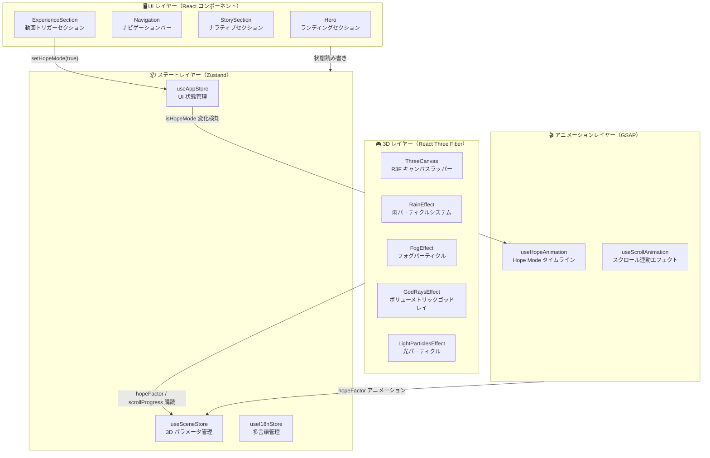
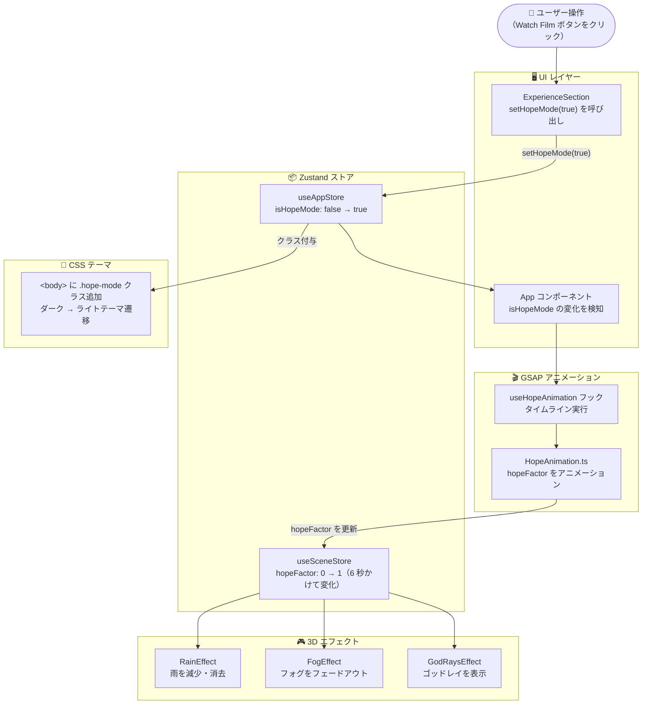
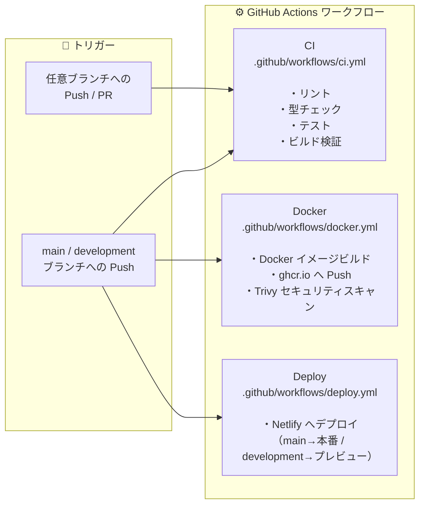

# 概要

**関連ソースファイル**: `Hope/CLAUDE.md` / `Hope/.claude/skills/hope-development/SKILL.md` / `Hope/package.json` / `Hope/src/components/` / `Hope/src/store/`

Hope 3D Experience は、2D UI 要素・リアルタイム 3D ビジュアルエフェクト・同期アニメーションを組み合わせた没入型 Web アプリケーションです。ユーザーの操作をきっかけに、暗く雨降る雰囲気から明るく前向きな環境へと協調的に変化する **"Hope Mode"** と呼ばれる変換シーケンスを実装しています。

このドキュメントは、システムアーキテクチャ・コアテクノロジー・主要サブシステムの技術的な概要を提供します。各領域の詳細については以下を参照してください。

- アーキテクチャの詳細 → [Architecture Overview]
- 完全な技術仕様 → [Technology Stack]
- UI コンポーネントの実装 → [User Interface Components]
- 3D レンダリングシステム → [3D Graphics System]
- アニメーションの調整 → [Animation System]
- 状態管理パターン → [State Management]

---

## プロジェクトの目的とスコープ

Hope 3D Experience は、React 19 と React Three Fiber で構築されたシングルページアプリケーション（SPA）であり、従来の Web UI と WebGL による 3D エフェクトを組み合わせたマルチメディアストーリーテリングプラットフォームです。

主な機能:

- 引用文と画像ギャラリーを持つ **4 つのナラティブセクション**
- デバイス性能に応じて粒子数を動的調整する **パフォーマンス適応型雨パーティクルシステム**（800〜4,000 粒子）
- リアルタイムの **フォグ・ゴッドレイ・ライティングエフェクト**
- **GSAP** によるアニメーションシーケンスのオーケストレーション
- **バイリンガル対応**（英語 / 日本語）と言語設定の永続化
- フルスクリーンオーバーレイ付き **YouTube 動画の埋め込み**

コードベースは React UI コンポーネント・Three.js シーン管理・GSAP アニメーションロジック・Zustand ステートストアを厳密に分離したモダンな TypeScript アーキテクチャを採用しています。

---

## システムアーキテクチャ

アプリケーションは、Zustand ステートストアを通じて通信する **4 つの主要アーキテクチャレイヤー** で構成されています。



### コンポーネントの責務

| レイヤー | コンポーネント | 主な責務 | 状態依存 |
|---------|--------------|---------|---------|
| UI | `Hero` | CTA ボタン付きランディングセクション | `useAppStore.loading` |
| UI | `Navigation` | セクションリンクとモバイルメニューを持つナビバー | `useI18nStore` |
| UI | `StorySection` | 引用文と画像スライダーのナラティブセクション | `useI18nStore` |
| UI | `ExperienceSection` | Hope Mode 変換をトリガーする動画セクション | `useAppStore.setHopeMode` |
| 3D | `ThreeCanvas` | React Three Fiber キャンバスラッパーとシーン構成 | なし（コンテキスト提供） |
| 3D | `RainEffect` | パフォーマンス適応型パーティクルシステム | `useSceneStore.hopeFactor` |
| 3D | `FogEffect` | フェードアウト遷移付きフォグパーティクル | `useSceneStore.hopeFactor` |
| 3D | `GodRaysEffect` | ボリューメトリックゴッドレイメッシュ | `useSceneStore.hopeFactor` |
| Animation | `useHopeAnimation` | Hope Mode タイムラインを管理する React フック | `useSceneStore`, `useAppStore` |
| Animation | `useScrollAnimation` | スクロール連動エフェクトの React フック | `useSceneStore.scrollProgress` |
| State | `useAppStore` | UI 状態: ローディング・Hope Mode・動画表示 | N/A（ルートストア） |
| State | `useSceneStore` | 3D パラメータ: hopeFactor（0→1）・scrollProgress | N/A（ルートストア） |
| State | `useI18nStore` | ロケール（`'en'`\|`'ja'`）・翻訳関数 | LocalStorage 永続化 |

---

## 技術スタック

### コア依存パッケージ

| パッケージ | バージョン | 用途 |
|-----------|-----------|------|
| `react` | 19.0.0 | 並行機能を持つ UI フレームワーク |
| `react-dom` | 19.0.0 | DOM 向け React レンダラー |
| `@react-three/fiber` | 9.0.0 | Three.js 向け React レンダラー |
| `@react-three/drei` | 10.7.7 | React Three Fiber ヘルパーコンポーネント |
| `three` | 0.183.1 | WebGL 3D グラフィックスライブラリ |
| `gsap` | 3.12.5 | プロフェッショナルグレードのアニメーションライブラリ |
| `zustand` | 5.0.0 | 軽量状態管理ライブラリ |

### 開発ツール

| パッケージ | バージョン | 用途 |
|-----------|-----------|------|
| `vite` | 7.3.1 | HMR 対応のビルドツール |
| `typescript` | 5.3.3 | 静的型チェック |
| `@biomejs/biome` | 2.3.11 | リンター & フォーマッター |
| `vitest` | 4.0.18 | テストフレームワーク |
| `@testing-library/react` | 16.0.0 | React コンポーネントテストユーティリティ |
| `bun` | 1.3.5 | JavaScript ランタイム & パッケージマネージャー |

### ランタイム環境

アプリケーションは WebGL をサポートするモダンブラウザで動作します。開発には Bun をパッケージマネージャーおよびランタイムとして使用し、本番環境は Netlify へのデプロイと Docker コンテナ化に対応しています。

---

## コアサブシステム

| サブシステム | エントリーポイント | 主なファイル | 説明 |
|------------|-----------------|------------|------|
| アプリルート | `src/main.tsx` | `src/components/App.tsx` | React アプリ初期化とルートコンポーネント |
| UI コンポーネント | `src/components/` | `Hero.tsx`, `Navigation.tsx`, `StorySection.tsx`, `ExperienceSection.tsx` | 2D ユーザーインターフェース要素 |
| 3D エフェクト | `src/components/three/` | `RainEffect.tsx`, `FogEffect.tsx`, `GodRaysEffect.tsx`, `LightParticlesEffect.tsx` | React Three Fiber コンポーネント |
| アニメーションロジック | `src/hooks/`, `src/animation/` | `useHopeAnimation.ts`, `HopeAnimation.ts`, `useScrollAnimation.ts`, `ScrollAnimation.ts` | GSAP タイムラインオーケストレーション |
| ステートストア | `src/store/` | `appStore.ts`, `sceneStore.ts`, `i18nStore.ts` | Zustand 状態管理 |
| メディアコンポーネント | `src/components/` | `ImageSlider.tsx`, `ImageModal.tsx`, `VideoThumbnail.tsx`, `VideoOverlay.tsx` | 画像ギャラリーと動画プレイヤー |
| 翻訳ファイル | `src/locales/` | `en.json`, `ja.json` | 国際化コンテンツ |
| スタイリング | `src/styles.css` | N/A | デザイントークンとテーマ切り替えを含むグローバル CSS |

---

## アプリケーションのデータフロー

以下の図は、ユーザー操作が状態管理レイヤーを通じてどのように視覚的な更新をトリガーするかを示しています。



### 状態更新フローの例

`ExperienceSection` の「Watch Film」ボタンをクリックした際の流れ:

1. `ExperienceSection` が `useAppStore` の `setHopeMode(true)` を呼び出す — `ExperienceSection.tsx:38`
2. `App` コンポーネントが `isHopeMode` の変化を購読・検知する — `App.tsx:20-30`
3. `useHopeAnimation` フックが GSAP タイムラインを実行する — `useHopeAnimation.ts:1-60`
4. タイムラインが `useSceneStore.hopeFactor` を 6 秒かけて 0 から 1 にアニメーションする — `HopeAnimation.ts:40-80`
5. `RainEffect`・`FogEffect`・`GodRaysEffect` が `hopeFactor` を購読し、ビジュアルパラメータを更新する — `RainEffect.tsx:50-70`
6. `<body>` に CSS クラス `hope-mode` が追加され、テーマ遷移がトリガーされる — `styles.css:944-1055`

---

## 開発ワークフロー

### クイックスタートコマンド

```bash
# 依存関係のインストール
bun install

# 開発サーバーの起動（http://localhost:5173）
bun dev

# テストをウォッチモードで実行
bun run test

# リンターを実行して自動修正
bun run lint:fix

# プロダクション向けビルド
bun run build
```

### プロジェクトのファイル構成

```
Hope/
├── src/
│   ├── main.tsx                    # React エントリーポイント
│   ├── styles.css                  # グローバルスタイルと CSS 変数
│   ├── components/
│   │   ├── App.tsx                 # ルートコンポーネント
│   │   ├── Hero.tsx                # ランディングセクション
│   │   ├── Navigation.tsx          # トップナビゲーション
│   │   ├── StorySection.tsx        # ナラティブセクション
│   │   ├── ExperienceSection.tsx   # 動画トリガーセクション
│   │   ├── ImageSlider.tsx         # 画像カルーセル
│   │   ├── ImageModal.tsx          # フルスクリーン画像ビューア
│   │   ├── VideoThumbnail.tsx      # ページ内動画プレイヤー
│   │   ├── VideoOverlay.tsx        # フルスクリーン動画プレイヤー
│   │   ├── LanguageToggle.tsx      # i18n 言語切り替え
│   │   └── three/                  # 3D エフェクトコンポーネント
│   │       ├── RainEffect.tsx
│   │       ├── FogEffect.tsx
│   │       ├── GodRaysEffect.tsx
│   │       ├── LightParticlesEffect.tsx
│   │       └── SceneSetup.tsx
│   ├── store/
│   │   ├── appStore.ts             # UI 状態管理
│   │   ├── sceneStore.ts           # 3D シーンパラメータ
│   │   └── i18nStore.ts            # 国際化
│   ├── hooks/
│   │   ├── useHopeAnimation.ts     # Hope Mode アニメーションフック
│   │   └── useScrollAnimation.ts   # スクロールアニメーションフック
│   ├── animation/
│   │   ├── HopeAnimation.ts        # Hope アニメーションクラス
│   │   └── ScrollAnimation.ts      # スクロールアニメーションクラス
│   └── locales/
│       ├── en.json                 # 英語翻訳
│       └── ja.json                 # 日本語翻訳
├── public/
│   ├── images/                     # ストーリーセクション画像（WebP）
│   └── textures/                   # 3D テクスチャ
├── package.json
├── tsconfig.json
├── vite.config.ts
└── biome.json
```

### コミット前のワークフロー

`Hope/` ディレクトリで以下のコマンドを順番に実行してからコミットしてください。

```bash
# 1. リント問題を自動修正
bun run lint:fix

# 2. リストエラーが残っていないか確認
bun run lint

# 3. 型チェックの実行
bunx tsc --noEmit

# 4. テストの実行
bun run test -- --run

# 5. 親ディレクトリからコミット
cd ..
git add -A
git commit -m "feat: 変更内容の説明"
```

---

## CI/CD パイプライン



| ワークフロー | トリガー | 目的 | ファイル |
|------------|---------|------|---------|
| CI | 任意ブランチへの Push / PR | リント・型チェック・テスト・ビルド検証 | `.github/workflows/ci.yml` |
| Docker | main / development への Push | Docker イメージビルド・ghcr.io プッシュ・Trivy セキュリティスキャン | `.github/workflows/docker.yml` |
| Deploy | main / development への Push | Netlify へのデプロイ（main→本番、development→プレビュー） | `.github/workflows/deploy.yml` |
